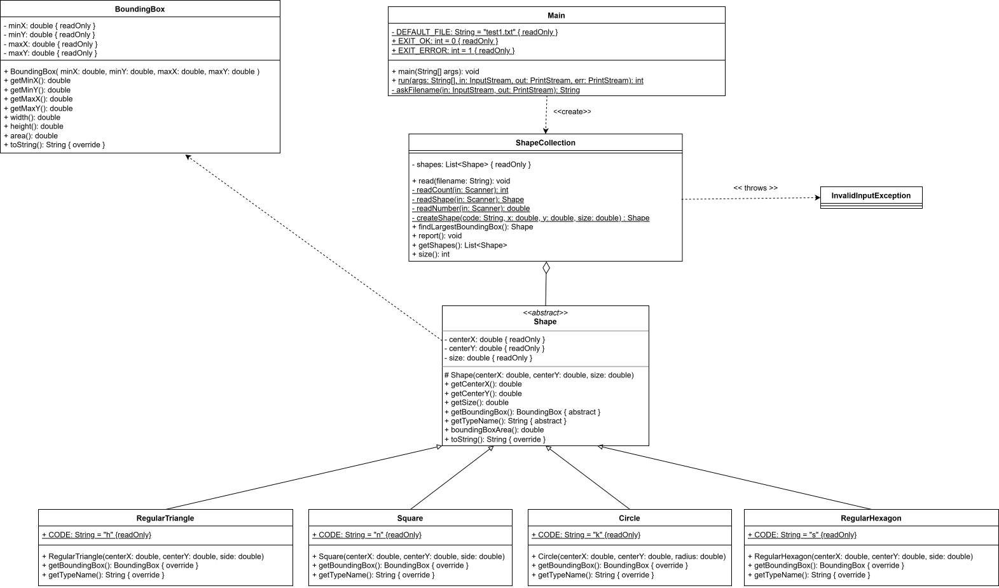

# Shapes – solution of the 1st take-home assignment (task 10)

A collection of regular shapes: the program reads the shapes from a text file and prints the one **whose bounding box has the largest area**.

## The task

Populate a collection with regular shapes (circle, regular triangle, square, regular hexagon), and find the shape whose bounding rectangle has the largest area. The bounding rectangle of a shape covers the shape completely, and its sides are parallel to the axes.

Every shape is given by its **center** and one **length**: the radius for the circle, the side length for the polygons. The polygons are placed so that one side is parallel to the horizontal axis, and the other vertices lie above the line of this side (the center of the triangle is its centroid).

| Shape                        | Code | Length   | Box width | Box height | Box area |
| ---------------------------- | ---- | -------- | --------- | ---------- | -------- |
| circle (kör)                 | `k`  | radius r | 2r        | 2r         | 4r²      |
| regular triangle (háromszög) | `h`  | side a   | a         | a·√3/2     | a²·√3/2  |
| square (négyzet)             | `n`  | side a   | a         | a          | a²       |
| regular hexagon (hatszög)    | `s`  | side a   | 2a        | a·√3       | 2√3·a²   |

The area of the bounding box depends only on the type and the length of the shape, not on its position. The shapes of the different types are stored in one collection, they are derived from a common abstract base class (`Shape`), and they are processed uniformly with a `foreach` loop.

## Input file

```
6
k 0 0 2.5
h 5 1 10
n -3 2 7
s 4 4 6
k 10 -3 4
n 1 1 3
```

- **Line 1:** the number of shapes (0 or more).
- **One line per shape:** shape code (`k`, `h`, `n`, `s`), x and y coordinate of the center, and the length (radius or side), separated by whitespace. The numbers can have a decimal part, written with a **decimal point** (`2.5`).

Blank lines and extra spaces are ignored. Files are read as UTF-8.

### What counts as invalid input

The program refuses the file, with a message naming the shape (e.g. `Shape 2: ...`), when

- the file is empty, or does not start with a whole number,
- the number of shapes is negative,
- there are fewer shapes than declared (data is missing),
- the shape code is unknown (codes are case-insensitive),
- a coordinate or the length is not a number (e.g. `abc`, or `1,5` with a decimal comma),
- the length is not positive, or a number is not finite (`NaN`, `Infinity`, a too big number),
- there is anything after the declared number of shapes (more data than expected).

## Running the program

The project needs **JDK 23 or newer**.

### In IntelliJ IDEA

Open the `Shapes` project and run `Main` (the green arrow next to `public static void main`). The program asks for the name of the input file in the Run window; an empty answer means `test1.txt`. Relative names are resolved against the project folder, so the bundled samples can be entered simply as `test2.txt`. The file name can also be given in *Run → Edit Configurations → Program arguments*.

### From the command line

Compile, then run from the project folder. The file name can be passed as an argument; without it the program asks for it.

```
javac -encoding UTF-8 -d build/classes src/shapes/*.java
java -cp build/classes shapes.Main test1.txt
```

```
Shapes in the collection:
Circle {center=(0.0, 0.0), size=2.5}, bounding box area: 25.00
Regular Triangle {center=(5.0, 1.0), size=10.0}, bounding box area: 86.60
Square {center=(-3.0, 2.0), size=7.0}, bounding box area: 49.00
Regular Hexagon {center=(4.0, 4.0), size=6.0}, bounding box area: 124.71
Circle {center=(10.0, -3.0), size=4.0}, bounding box area: 64.00
Square {center=(1.0, 1.0), size=3.0}, bounding box area: 9.00

The shape with the largest bounding box: Regular Hexagon {center=(4.0, 4.0), size=6.0}
Its bounding box: [(-2.00, -1.20) - (10.00, 9.20)], area: 124.71
```

Results are written to the standard output, errors to the standard error. The exit code is `0` on success and `1` if the file could not be read or was invalid. The numbers are always written with a decimal point, whatever the language settings of the computer are.

### Bundled sample files

| File               | Result                                                                      |
| ------------------ | --------------------------------------------------------------------------- |
| `test1.txt`        | All four kinds of shapes: the regular hexagon wins, area 124.71             |
| `test2.txt`        | Single winner: the circle, area 100.00                                      |
| `test3.txt`        | Area tie: the first shape in the file wins (the square, area 16.00)         |
| `test_invalid.txt` | Error: `Shape 2: Unknown shape code: x`                                     |

If several shapes share the largest area, the first one in the file is the result. If the collection is empty, there is no result. Reading a second file adds its shapes after the shapes already loaded; a file that is refused changes nothing.

## Running the tests

The tests are JUnit 4 tests in the `test` folder.

- **IntelliJ IDEA:** mark the `test` folder as *Test Sources Root* (right-click → *Mark Directory as*). If `@Test` is red, press **Alt+Enter** on it and choose *Add 'JUnit4' to classpath*. Then right-click the `test` folder → *Run 'All Tests'*; the results appear in the *Run* window.
- **Command line:** with the `junit-4.13.2.jar` and `hamcrest-core-1.3.jar` files in the project folder (on Windows use `;` instead of `:`):

  ```
  javac -encoding UTF-8 -cp build/classes:junit-4.13.2.jar:hamcrest-core-1.3.jar -d build/test-classes test/shapes/*.java
  java -cp build/classes:build/test-classes:junit-4.13.2.jar:hamcrest-core-1.3.jar org.junit.runner.JUnitCore shapes.BoundingBoxTest shapes.ShapeTest shapes.ShapeCollectionTest shapes.ShapeFileReaderTest shapes.MainTest
  ```

All 91 tests pass.

| Test class            | What it covers                                                                                   |
| --------------------- | ------------------------------------------------------------------------------------------------ |
| `BoundingBoxTest`     | Width, height and area, degenerate boxes, rejected corners (minimum above maximum, NaN), text form with a decimal point |
| `ShapeTest`           | For every kind of shape: rejected sizes (zero, negative, NaN, infinite) and coordinates (NaN, infinite), accepted edge values (tiny size, negative center), the bounding box and its area, independence of the position, codes and type names |
| `ShapeCollectionTest` | Finding the largest bounding box: each kind of shape can win, first/middle/last position, tie (the first shape wins), far away shapes, empty collection, reading a second file, a refused file keeps the shapes loaded before, read-only list |
| `ShapeFileReaderTest` | Parsing valid files (case-insensitive codes, decimal and negative numbers, Windows line endings, zero shapes) and every kind of invalid input listed above, file name problems (null, empty, blank, directory, missing file) |
| `MainTest`            | The whole program: output of all shapes and of the winner, decimal point whatever the language settings are, asking for the file name, empty collection, error messages, nothing on the output after an error, exit codes |

The API documentation can be generated in IntelliJ IDEA with *Tools → Generate JavaDoc*.

## Design



| Class                                                   | Responsibility                                                                                   |
| ------------------------------------------------------- | ------------------------------------------------------------------------------------------------ |
| `Shape`                                                 | Abstract base class. Stores the center and the length, validates them; the shapes only supply their own bounding box. |
| `Circle`, `RegularTriangle`, `Square`, `RegularHexagon` | The four kinds of shapes: their code in the file, their name and their bounding box.             |
| `BoundingBox`                                           | Immutable axis-parallel rectangle; calculates its own width, height and area.                    |
| `ShapeCollection`                                       | Stores the shapes in a collection, reads and validates the input, finds the largest bounding box, prints the report. |
| `InvalidInputException`                                 | Checked exception for invalid input, with a message fit for the user.                            |
| `Main`                                                  | Command line interface: gets the file name, prints the result, handles the exceptions.           |

### Short description of the methods

**`Shape`**

| Method | Description |
| ------ | ----------- |
| `Shape(centerX, centerY, size)` | Checks that the coordinates are finite and the length is a finite, positive number; otherwise `IllegalArgumentException`. |
| `getBoundingBox()` *(abstract)* | The bounding box of the shape; every descendant computes it with its own formula. |
| `getTypeName()` *(abstract)* | The name of the type, used in the output. |
| `boundingBoxArea()` | The area of the bounding box. |
| `getCenterX()`, `getCenterY()`, `getSize()` | Getters. |
| `toString()` | The text form of the shape. |

**Bounding box of the descendants.** The box of the circle is 2r × 2r, the box of the square is a × a. The height of a triangle is h = a·√3/2 and its centroid is h/3 above the base, so the bottom of the box is h/3 below the center and the top vertex is 2h/3 above it; the box is a wide. For the hexagon two opposite vertices are 2a apart and the two horizontal sides are a·√3 apart.

**`BoundingBox`**

| Method | Description |
| ------ | ----------- |
| `BoundingBox(minX, minY, maxX, maxY)` | Creates the rectangle; `IllegalArgumentException` if a minimum is greater than the maximum. |
| `width()`, `height()`, `area()` | The size of the rectangle. |
| `getMinX()`, `getMinY()`, `getMaxX()`, `getMaxY()` | The corners. |

**`ShapeCollection`**

| Method | Description |
| ------ | ----------- |
| `read(filename)` | Reads the number of the shapes, then that many shapes. Throws `IOException` if the file cannot be read, `InvalidInputException` if its content is invalid. The shapes are added to the collection only if the whole file is valid. |
| `readCount(...)`, `readShape(...)`, `readNumber(...)` *(private)* | Read and check the number of the shapes, one shape, and one number. |
| `createShape(...)` *(private)* | "Factory" method: creates the shape that belongs to the code. |
| `findLargestBoundingBox()` | With a `foreach` loop finds the shape with the largest bounding box; `null` if the collection is empty. |
| `report(out)` | Prints the shapes with the area of their bounding boxes, then the result. |
| `getShapes()`, `size()` | A read-only view of the shapes, and their number. |

**`Main`**

| Method | Description |
| ------ | ----------- |
| `main(args)` | Runs the program and terminates with the exit code. |
| `run(args, in, out, err)` | The whole program on the given streams (so it can be tested); returns the exit code. |
